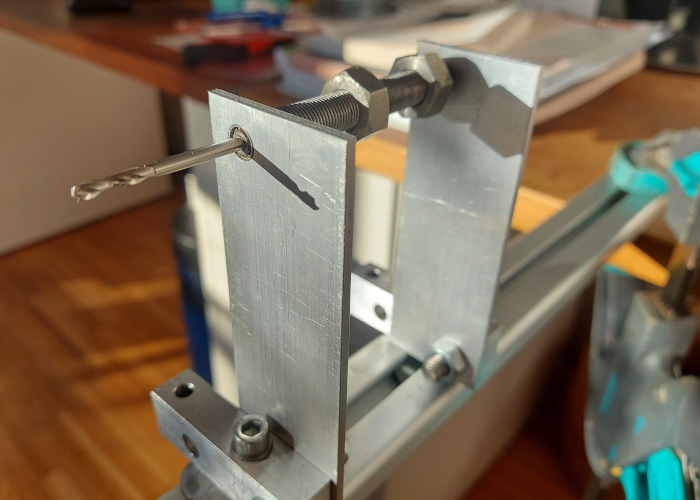
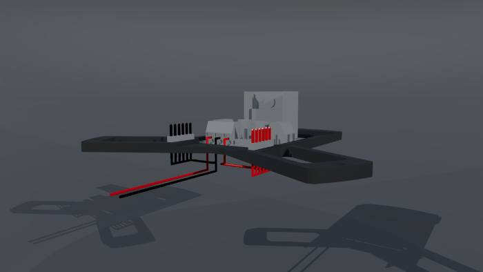
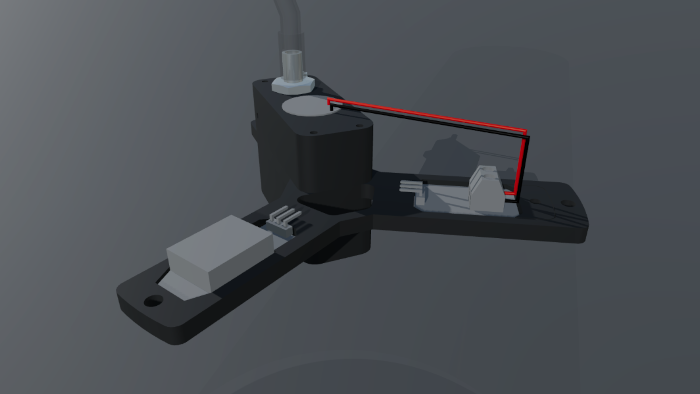
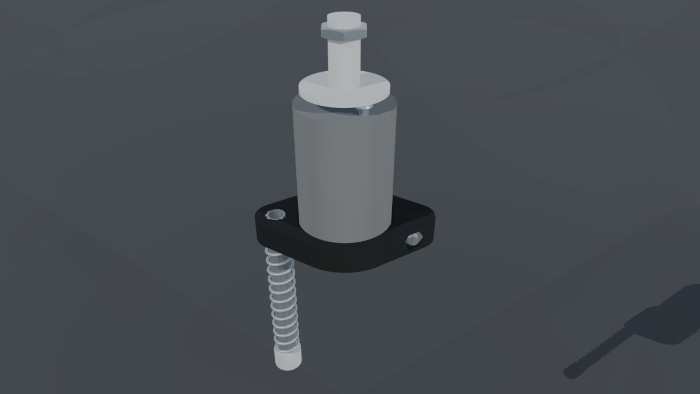
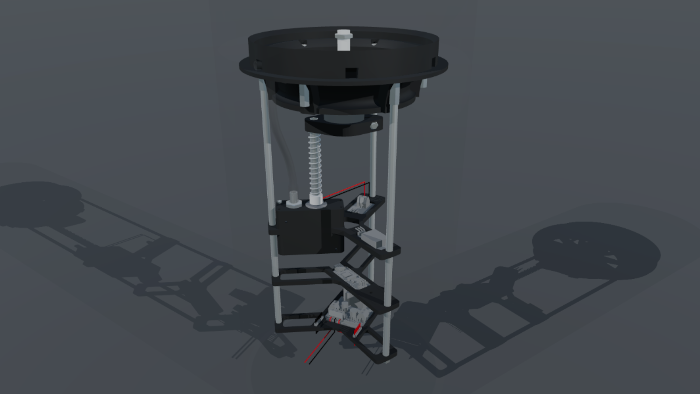
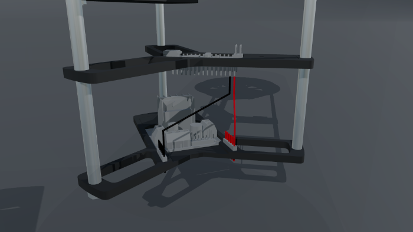
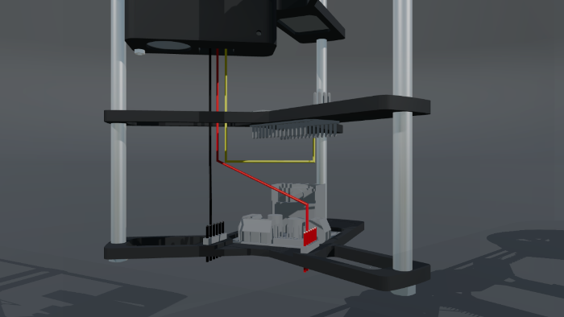

# PRINTABLE PURIFIER ASSEMBLY

### 1. Hub and Impeller 1

This is the most critical step, so let's get it done first to be able to adapt to it later. Be sure the z-axis of your printer is perpendicular to the bed, or your impeller will get a bad wobble.

Print [Lower hub](../unit_purifier/unit_inner/unit_hub/print_hub_1.stl) and [Lower impeller](../unit_purifier/unit_impeller/print_impeller_1.stl) first and make the [Impeller mount](../unit_purifier/unit_inner/unit_motor/lathe_motor_connect.stl) or have it made. Get a 555-1 type motor and have two flat M3 screws ready.

The impeller may have require balancing initially. I build a very simple balancing utility to find the heavier side of the impeller, but you could also just mount the impeller on a 10mm rod, then put both ends of the rod on equal height and horizontal surfaces. The impeller would then roll back and forth to find its balance. Another way is balancing by trial and error while mounted.

Insert counterweights into the provided 6mm holes as required until vibration is tolerable when the impeller is spinning in the hub. I used 6mm brass rod pieces as counterweights.

### 2. Hub and Impeller 2

Print [Upper hub](../unit_purifier/unit_inner/unit_hub/print_hub_2.stl) and [Upper impeller](../unit_purifier/unit_impeller/print_impeller_2.stl). Have M4 screws and 20MM M4 nuts ready. Repeat balancing with the upper impeller. I got the 20mm long M4 nuts in electronics supply rather than in a hardware store.

### 3. Inners

In the next steps the inner parts of the purifier is built.

3.1 Power

Build power unit as described in [Power](../unit_purifier/unit_inner/unit_power). Connect wires as of L298N Motor Controller documentation. Soldering is required to connect the 5V output of the L298N to the 6 power terminal power pin headers and to connect the 6 ground pin headers to ground.

3.2 Arduino

Build arduino unit as described in [Arduino](../unit_purifier/unit_inner/arduino_nano). No cables yet.

3.3 Sensors

Build sensor unit as described in [Sensors](../unit_purifier/unit_inner/unit_sensors). No cables other than the vibration sensors own cables yet.

3.4 Motor

Build Motor assembly from part descriptions in [Motor assembly](../unit_purifier/unit_inner/unit_motor).

3.5 Inner Assembly

Assemble hub, motor, sensors, arduino and power units to the full inner unit.

3.6 Arduino Wiring

Connect the Arduino VIN pin to one of the 5V pins. Connect the Arduino GND pin to one of the ground pins.

3.7 Motor wiring

Connect the Arduino D9 pin to the L298N ENA pin. Connect the Arduino D8 pin to the L298N IN1 pin. Connect the Arduino D7 pin to the L298N IN2 pin. Connect the L298N OUT1 pin to one of the motor's pins. onnect the L298N OUT2 pin to the other motor pin. It does not matter which motor pins are connected, you can set motor direction later from the arduino sketch. Refer to [Interface L298N DC Motor Driver Module with Arduino](https://lastminuteengineers.com/l298n-dc-stepper-driver-arduino-tutorial/) for more information.

3.8 Dust Sensor wiring

Connect the Arduino D3 pin to the dusst sensor digital cable. Connect the dust sensor power cable to one of the 5V pins. Connect the dust sensor ground cable to one of the ground pins. Refer to [PM-D4](http://www.csfan.co.kr/bbs/board.php?bo_table=products1&wr_id=15&ckattempt=1) for more information.

