# PRINTABLE PURIFIER BUILDING INSTRUCTIONS

### 1. Hub 1 and Impeller 1

The perhaps most challenging step in this build comes first. Be sure the z-axis of your printer is perpendicular to the bed, or your impeller will get a bad wobble.

Print [Lower hub](../unit_purifier/unit_inner/unit_hub/print_hub_1.stl) and [Lower impeller](../unit_purifier/unit_impeller/print_impeller_1.stl). Note that Lower hub is printed upside down. Use pliers to remove supports from the hub. Make the [Impeller mount](../unit_purifier/unit_inner/unit_motor/lathe_motor_connect.stl) or have it made. A 555-1 type motor is needed and two flat M3 screws to fix the motor to the hub.

The impeller will require balancing after printing. This can be done by adding counterweights to one or more holes provided in the printed impeller. I cut pieces off a 6mm brass rod and used those as counterweights.

I built a very simple balancing tool to find the heavier side of the impeller, but you could also just mount the impeller on a 10mm rod, then put both ends of the rod on horizontal surfaces of equal height. The impeller can then roll back and forth to find its balance. At first the impeller will want to settle in a specific position. Add counterweights until the impeller appears not to have a specific settling point any more.

You can also balance by trial and error while in the hub, but this can be lengthy process requiring a lot of patience.

Insert counterweights into the provided 6mm holes as required until vibration is tolerable when the impeller is powered by the motor and spinning in the hub.

---

### 2. Hub 2 and Impeller 2

Print [Upper hub](../unit_purifier/unit_inner/unit_hub/print_hub_2.stl) and [Upper impeller](../unit_purifier/unit_impeller/print_impeller_2.stl). M4 screws and 20MM M4 nuts are needed to connect the two hub parts. When you have a hard time finding the long M4 nuts search in electronics supply, these are used in computer builds, so you will hav good chanced to find them there. You will have to use a long M4 screw to pull the nuts into their seat in the lower hub, where they should find a firm fit.

Repeat balancing with the upper impeller.

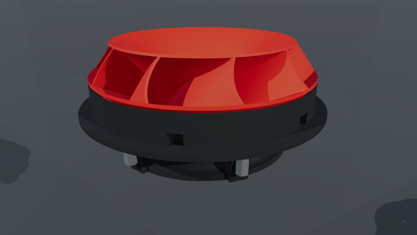

---

### 3. Inners

In the next steps the inner parts of the purifier are built.

3.1 Power

Build power unit from the parts listed in [Power](../unit_purifier/unit_inner/unit_power). Connect 12V power cable to the VS pin of the controller. Connect ground to the GND pin of the controller. Connect the controllers 5V pin to all six 5V pins (these will later provide power to arduino, sensors, ...). Connect the GNF pin of the controller (now two cables in the GND pin) to all six GND pins (these will later be the GND pins for arduino, sensors, ...).

Soldering is required to connect the 5V output of the L298N to the power pins and to connect the GND pin to the GND pins.

Please refer to [Interface L298N DC Motor Driver Module with Arduino](https://lastminuteengineers.com/l298n-dc-stepper-driver-arduino-tutorial/) for more information.

3.2 Arduino

Build arduino unit from the parts listed in [Arduino](../unit_purifier/unit_inner/unit_nano). No cables yet.

3.3 Sensors

Build sensor unit from the parts listed in [Sensors](../unit_purifier/unit_inner/unit_sensors). No cables other than the vibration sensors internal cable yet.

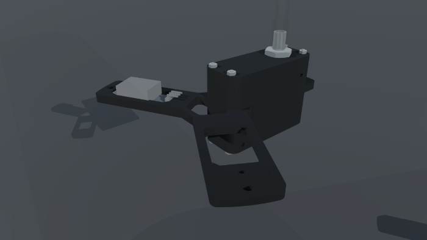

3.4 Motor

Build Motor assembly from from the parts listed in [Motor assembly](../unit_purifier/unit_inner/unit_motor).

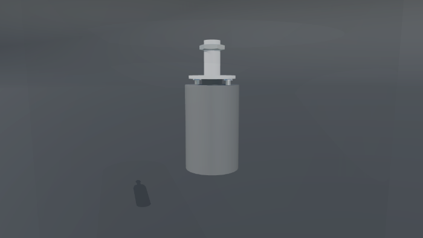

3.5 Inner Assembly

Assemble hub, motor, sensors, arduino and power units to the full inner unit with the parts listed in [Screws](../unit_purifier/unit_inner/unit_screws).

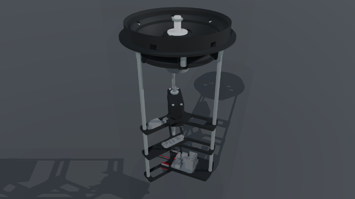

3.6 Arduino Wiring

Connect the Arduino VIN pin to one of the 5V pins on the power unit. Connect the Arduino GND pin to one of the ground pins on the power unit.

3.7 Motor wiring

Connect the Arduino D9 pin to the L298N ENA pin. Connect the Arduino D8 pin to the L298N IN1 pin. Connect the Arduino D7 pin to the L298N IN2 pin. Then connect the L298N OUT1 pin to one of the motor's pins and connect the L298N OUT2 pin to the other motor pin. It does not matter which motor pins are connected, you can set motor direction later from the arduino sketch. Please refer to [Interface L298N DC Motor Driver Module with Arduino](https://lastminuteengineers.com/l298n-dc-stepper-driver-arduino-tutorial/) for more information.

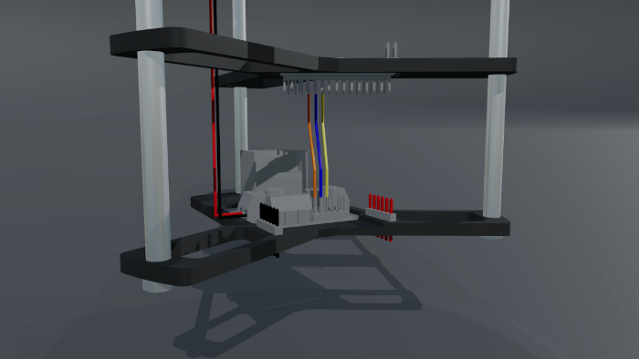

3.8 Dust Sensor wiring

Connect the Arduino D3 pin to the dust sensor digital cable. Connect the dust sensor power cable to one of the 5V pins. Connect the dust sensor ground cable to one of the ground pins. Please refer to [PM-D4](http://www.csfan.co.kr/bbs/board.php?bo_table=products1&wr_id=15&ckattempt=1) for more information.

3.9 Temperature and Humidity Sensor wiring

Connect the Arduino D4 pin to the DHT22 sensor output pin. Connect the DHT22 sensor power pin to one of the 5V pins. Connect the DHT22 sensor GND pin to one of the ground pins. Please refer to [DHT 22](https://joy-it.net/de/products/SEN-DHT22) for more information.

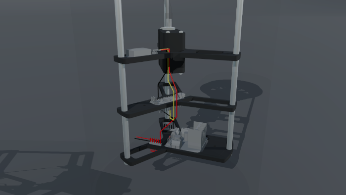

3.10 Vibration Sensor wiring

Connect the Aeduino A1 pin to the vibration sensor output pin. Connect the vibration sensor GND pin to one of the ground pins. The vibration sensor does not need power input!

Please refer to [VIB 01](https://joy-it.net/de/products/SEN-VIB01) for more information.

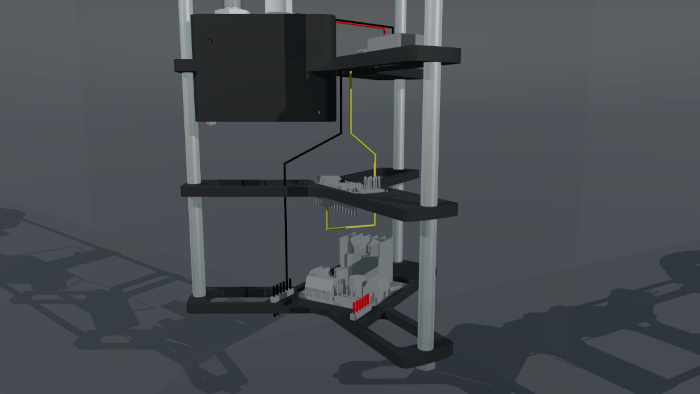

3.11 Potentiometer wiring

Connect the Arduino A0 pin to a 20cm yellow cable. Connect a 20 cm red cable one of the 5V pins. Connect a 20 cm black cable to one of the ground pins.

Solder a 10cm yellow cable to the potentiometer signal pin. Solder a 10cm red cable to the potentiometer VC pin. Solder a 10cm black cable to the potentiometer GND pin. Later the cables from the potentiometer will be stuck through one of the hub openings and connected to the respective inner cables.

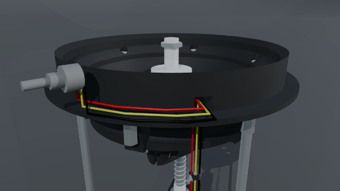

3.12 Display wiring

Connect the Arduino A4 (SDA) pin to a 20cm yellow cable. Connect the Arduino A5 (SCL) pin to a 20cm blue cable. Connect a 20 cm red cable one of the 5V pins. Connect a 20 cm black cable to one of the ground pins.

Connect a 10cm yellow cable to the display's SDA pin.  Connect a 10cm blue cable to the display's SCL pin. Connect a 10cm red cable to the display's VCC pin. Connect a 10cm black cable to the display's GND pin. Later the cables from the display will be stuck through one of the hub openings and connected to the respective inner cables.

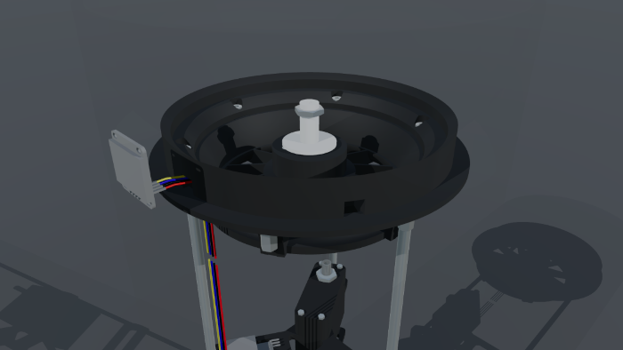

Please refer to [0.96 INCH OLED SCREEN WITH I2C](https://whadda.com/product/0-96-inch-oled-screen-with-i2c-wpi438/) for more information.

3.13 Wiring completed

With all cables in place, the inner unit should look like this.

---

### 4. Arduino Sketch

**IMPORTANT: when you are connecting a USB cable to your Arduino, you must disconnect the arduino from the inner power supply, since it will then get it's power through USB. I pulled the VIN cable when uploading new code, but left the GND connected to the motor controller. After the code does what it should disconnect both USB and 12V power supply, then reconnect the VIN cable to the controller, then power up the now standalone system with 12V.**

Please find the arduino sketch that i am using here [Sketch](../code/sketch_purifier/sketch_purifier.ino). I will describe the sketch in more detail when time allows.

---

### 5. Head

In the next steps the head of the purifier is built. Full part list here: [Head](../unit_purifier/unit_head).

5.1 Lower head

Print [Lower head](../unit_purifier/unit_head/print_outer_controls.stl). Note that this part is printed upside down. Use pliers to remove supports, then clean up the the openings for the display and the potentiometer until they fit properly. Remove display and potentiometer again, they will be finally inserted in a later step.

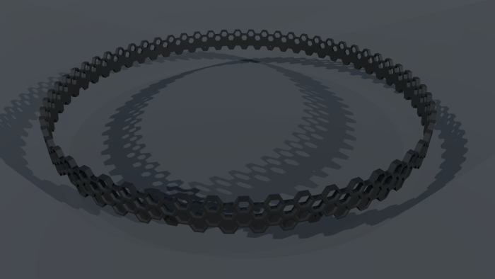

5.2 Upper head

Print [Upper head](../unit_purifier/unit_head/print_outer_ring.stl). Note that this part is printed upside down. Place The upper head into Lower head and glue them together. Before applying glue, please check that the glue you are using works good with PLA. I used "UHU Hartplastik", which you can get in most hardware stores where i live.

After the glue has dried, sand the outfacing surface of the head, then spray paint the outside in multiple, thin layers. Like with the glue be sure that the spray you are using does not negatively affect your materials.

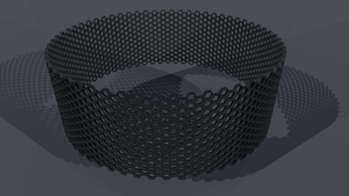

5.3 Head Connector

Print [Head Connector](../unit_purifier/unit_head/print_outer_connect.stl). Note that the part is printed upside down. Cut a piece of 2mm foam rubber to match the bottom surface, cut holes where screws and cable outlets are, then glue the foam rubber in place. Again be sure the glue does not harm both foam rubber and PLA.

5.4 Inner Head

Print [Inner Head](../unit_purifier/unit_head/print_outer_outlet.stl). Note that the part is printed upside down. Use a 4mm drill to open the screwholes in this part. Use a M4 screw of appropriate length to pull M4 nuts into their seats in this part. Sand inner surface and spray paint for a good surface finish.

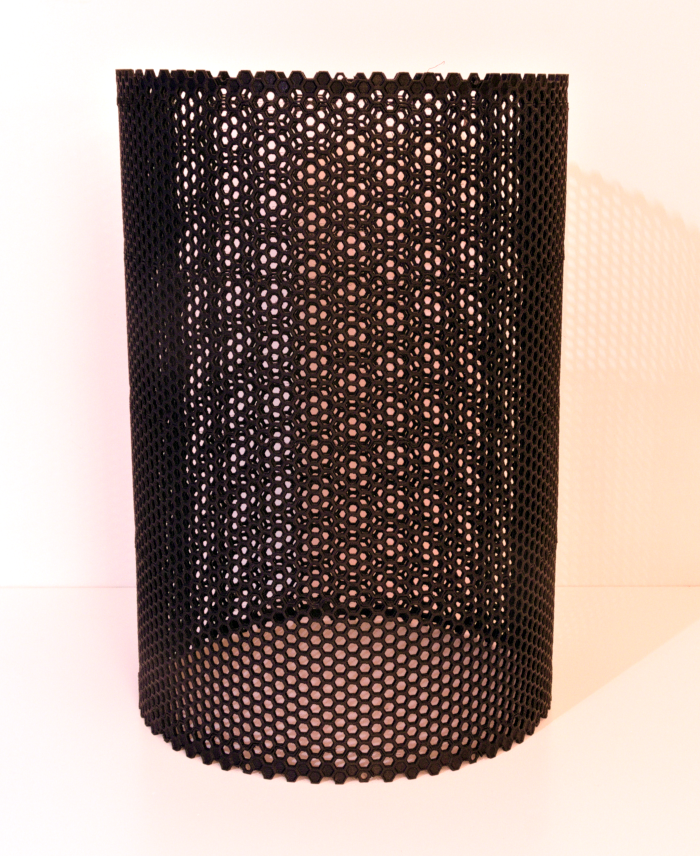

5.5 Head Assembly

Reinsert display and potentiometer into the outer ring. Use the nut provided with the potentiometer to tighten it in place. Slide in the flat connector ring from underneath. Slide in the Inner head from the upside. Be careful not to harm the display and potentiometer cables, which should be passing through adjacent cable outlets now.

Use M4 screws to screw the connector and the inner part together. When done, the purifier head should look like this.

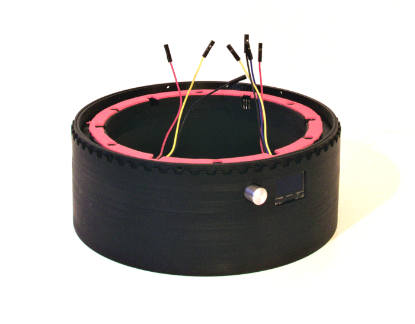

---

### 6. Head

Let's add a housing around the filter. I split the housing into 6 parts to split up printer time a bit. If you have a printer that can handle large parts with enough precision, you could just merge some parts to save sanding at the part junctions. Full part list here: [Housing](../unit_purifier/unit_honeycomb).

6.1 Lower housing

Print [Lower housing](../unit_purifier/unit_honeycomb/print_honeycomb_1.stl). Use pliers to remove supports, then clean the upper and lower bounds with file and sandpaper. I used sandpaper wrapped around a 5mm allen key, thus being able to sand multiple surfaces at once. Cleaning up the hexagon boundary is quite a lot of work, but it ensures a good fit between the housing parts, when they are glued together in a later step.

Widen the 1mm holes to 2mm, then to 3mm. Be careful doing so, but don't worry if one of the hexagons breaks while drilling.

6.2 Center housing

Print 4 pieces of [Center housing](../unit_purifier/unit_honeycomb/print_honeycomb_2.stl). Remove supports and apply the cleanup steps described in 6.1.

6.3 Upper housing

Print [Upper housing](../unit_purifier/unit_honeycomb/print_honeycomb_3.stl). Remove supports and apply the cleanup steps described in 5.1., open the 1mm holes to 3mm as described in 5.1.

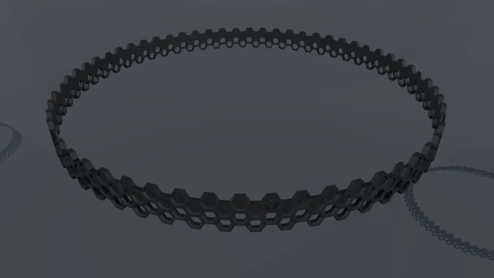

6.4 Housing Assembly

After careful sanding all 6 parts will have a good fit and can be glued together. Be sure to use glue that does not affect PLA negatively, ie. "UHU Hartplastik". Go in steps, apply glue to the lower part, attach the upper part, ensure good alignment then apply pressure i.e. by placing a large book on the upper part, settle, iterate.

Sand the outside of the assembled housing, spray paint for a good finish.

Expect the housing to look like so.

---

### 7. Foot

Print [Foot](../unit_purifier/unit_foot/print_outer_foot.stl). Use pliers to clear the hole for the power plug, then cut an 8x1 thread to accomodate the plug's thread. Sand and spray paint for a good finish. Cut 2mm foam rubber to fit both upper and lower side of the foot, then glue it onto the respective surfaces. Again, be sure to use glue that does not interfere with PLA or foam rubber.

---

### 8. Filter

Cut 2mm foam rubber to fit the filter's ~160m diameter top area and glue it to the filter. Depending on the final height of your housing build you may need 2 layers of foam rubber here. Drill a 12mm hole into the bottom of your filter to allow the power cable to exit.

---

### 9. Cover

Print [Impeller cover](../unit_purifier/unit_cover/print_cover_1.stl) and [Customizeable cover](../unit_purifier/unit_cover/print_cover_2.stl). Sand and spray paint the center for a good finish.

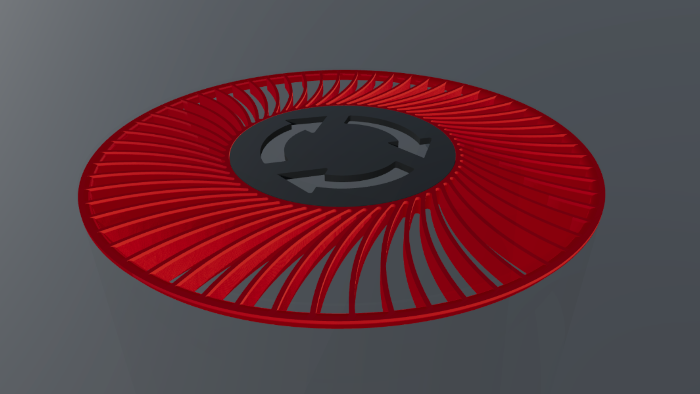

---

### 10. Final assembly

